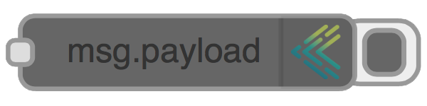

# node-red-contrib-keymetrics

[](https://gemnasium.com/vergissberlin/node-red-contrib-keymetrics) [](https://travis-ci.org/vergissberlin/node-red-contrib-keymetrics) [](http://inch-ci.org/github/vergissberlin/node-red-contrib-keymetrics) []( https://github.com/vergissberlin/node-red-contrib-keymetrics/issues "GitHub ticket system") [](https://npmjs.org/package/node-red-contrib-keymetrics "View this project on npm") [](https://gitter.im/vergissberlin/node-red-contrib-keymetrics?utm_source=badge&utm_medium=badge&utm_campaign=pr-badge&utm_content=badge)

---

[](http://inch-ci.org/github/vergissberlin/node-red-contrib-keymetrics)


**If you are using**

- the fantastic program [Node-RED](http://nodered.org), 
- running it with [PM2](https://github.com/Unitech/pm2) <sup>[1](#glossary)</sup> and 
- monitor with [keymetrics.io](http://keymetrics.io) <sup>[2](#glossary)</sup>, 

**that node is made for you!**

---
## Features

- Send all input messages to *Keymetrics* as event or metrics
- The Debug node can be connected to the output of any node. It can be used to push the output of any message property to the *Keymetrics* dashbord. The default is to display **msg.payload**.
- The button to the right of the node will toggle its output on and off so you can de-clutter the debug window.
- Optionally can show the complete **msg** object.
- Alerts are also displayed as alerts in Keymetrics.

## Installation

### PM2 & Keymetrics
- To run *Node-RED* with *PM2* have a look on [Node-RED documentation](http://nodered.org/docs/getting-started/running.html)
- To integrate *Keymetrics* register and after that may look at [this](https://github.com/Unitech/pm2).
- Check whether *Keymetrics* receives data.

### Node package

- Then we can install the new node, and restart *Node-RED*: 
```bash
cd ~/.node-red
npm install node-red-contrib-keymetrics
pm2 restart node-red
```
Open your *Node-RED* Frontend and you will find the new node under the group *output*. **Happy wiring!**

---
###### Glossary <a id="glossary"></a>
1. *[PM2](https://github.com/Unitech/pm2) is a process manager for [Node.js](https://nodejs.org). It makes it easy to run applications on boot and ensure they are restarted if necessary.*
- *[keymetrics.io](http://keymetrics.io) makes it easy to monitor and manage apps accross servers.*


[](https://bitdeli.com/free "Bitdeli Badge") [](https://greenkeeper.io/)

